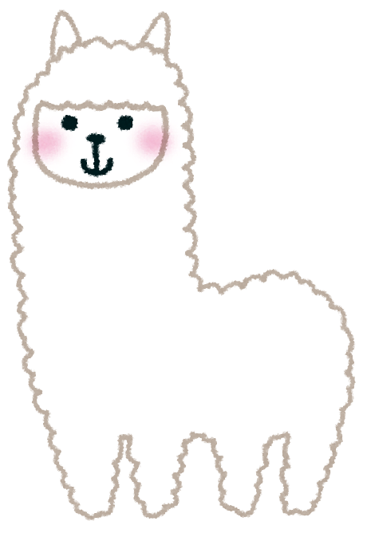

# サーバー構築とCMS作成

記事の本文

## Twitter

* <blockquote class="twitter-tweet" data-lang="ja">
Twitter埋め込み<a href="
https://t.co/8WjG1GFAKL"> pic. twitter. com/8WjG1GFAKL</a>
&mdash; Ryuichi Ueda (@ryuichiueda)<a href ="https://twitter.com/ryuichiueda/status/895812078354563072">2017年8月11日</a></blockquote>

* [別の記事へのジャンプ](#alpaca)

## ビーバー

## アルパカ

[Wikipedia](https://ja.wikipedia.org/wiki/%E3%83%93%E3%83%BC%E3%83%90%E3%83%BC)

